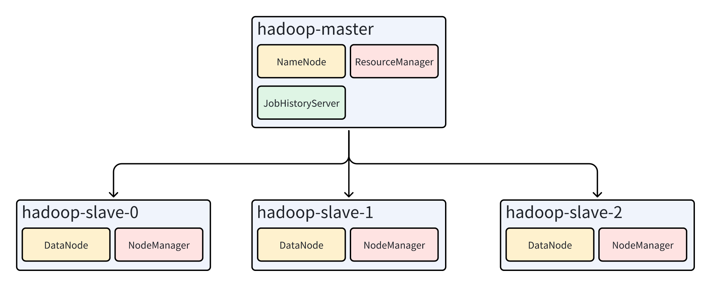

# 使用docker搭建hadoop集群
## 集群架构
一主三从  

## 准备
1. 安装docker以及docker-compose
2. 克隆代码  
`git clone https://github.com/huanggomery/docker-compose-hadoop.git`
3. 下载镜像  
`docker pull huanggomery/hadoop`

## hadoop（非HA模式）
1. 进入hadoop目录  
`cd docker-compose-hadoop/hadoop`
2. 使用docker-compose创建集群  
`docker-compose -f docker-compose.yaml up -d`
3. 在浏览器中验证集群状态  
	hadoop集群：127.0.0.1:9870  
	yarn集群：127.0.0.1:8088  

## Spark
1. 启动hadoop集群
2. 进入hadoop-master的命令行  
`docker exec -it hadoop-master bash`
3. 运行spark程序时，只需加上`--master yarn`选项即可，例如：  
`pyspark --master yarn`  
`spark-submit --master yarn --deploy-mode client|cluster 程序名 参数`  

## Flink（Per-Job Mode）
1. 启动hadoop集群
2. 进入hadoop-master的命令行  
`docker exec -it hadoop-master bash`
3. 运行flink示例程序  
`flink run -m yarn-cluster -yn 2 -yjm 1024 -ytm 1024 /opt/apache/flink/examples/batch/WordCount.jar`